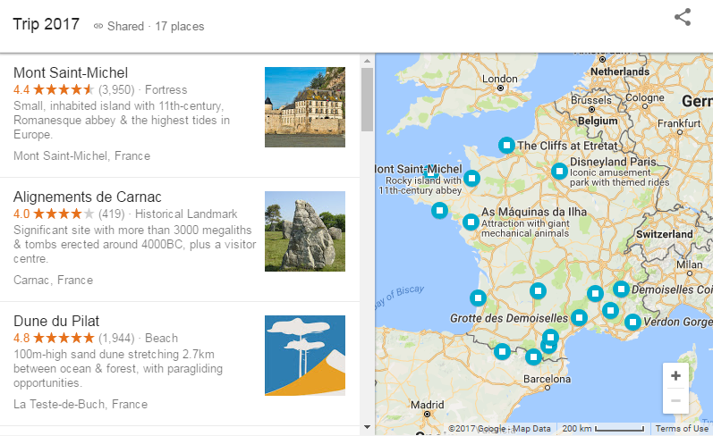
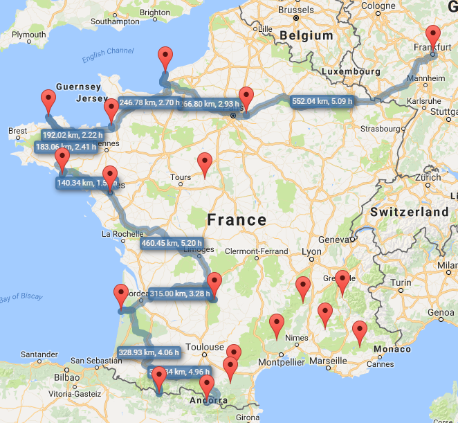

# Source data

Google Maps for Android allows you to save places into a named place-list.

After using share button you can see these points on the PC.

This page is quite limited. Maybe it will evolve in the future, but in order to use saved points we have to do process data manually.

# Result

TL;DR; This is what we aim for.

# Process

View source of the Google placelist. Find the definition of *ctx* variable. It contains JSON data for some kind of context object. Save it to ``scratch.json``.

Run ``php extract.php`` which will try to extract POI from the context object. The results are put into ``trip2017.json``.

Do the usual ``npm install`` and run ``index.html`` in the browser.
The JS will read POI from the file, display them on the screen and fetch the routes between the points from Google. The resulting distance and driving time are displayed on the map.

# TODO

* The routing stops after some time. Need to fix promises so that one broken route does not stop the whole chain. Help needed.
* Sidebar of the screen is reserved to showing places and their details.
* Places in the sidebar should be draggable to rearrange the route and toggleable to disable some points. Routes should recalculate accordingly.
* Maybe we can retrieve points from Google using API. Then we don't need to hack-extract the data by PHP.
